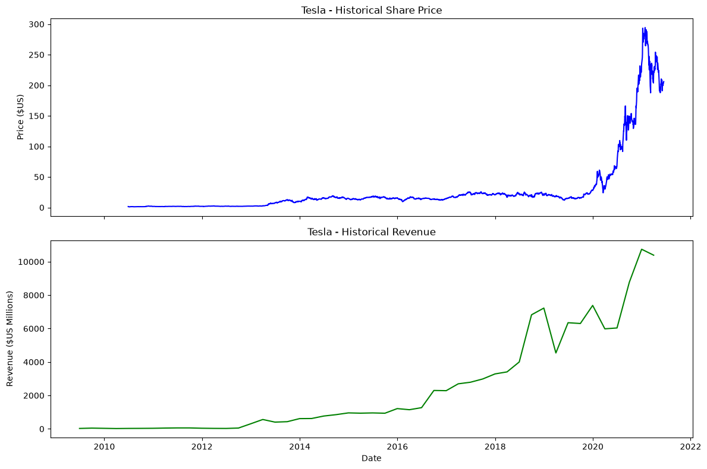
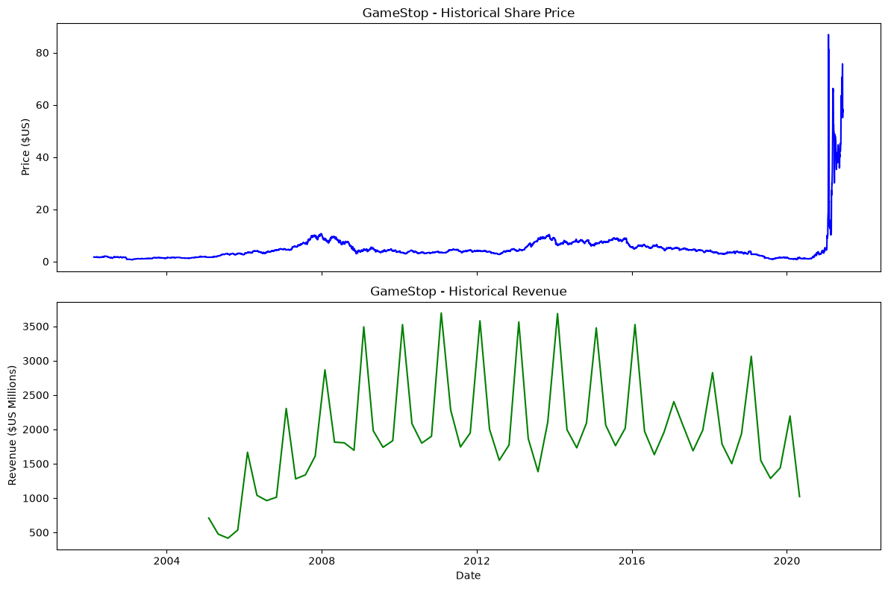

# 📈 Revenue Data and Building a Dashboard

## Overview

This project demonstrates how Python can be used to collect, clean, analyze, and visualize real-world financial data. Using Tesla and GameStop as case studies, the project combines stock price data with quarterly revenue data to build interactive dashboards and explore business trends.

---

## Project Objectives

- Extract historical stock price data using APIs.
- Collect quarterly revenue data through web scraping.
- Clean and preprocess the collected data.
- Analyze financial trends.
- Build interactive dashboards to visualize stock price and revenue over time.

---

## Technologies Used

- Python
- Pandas
- yfinance
- BeautifulSoup
- Requests
- Jupyter Notebook

---

## Project Workflow

### 1. Data Collection

- Retrieved Tesla and GameStop stock price data using the **yfinance** API.
- Scraped quarterly revenue data using **BeautifulSoup**.

### 2. Data Cleaning

- Removed unnecessary symbols and formatting.
- Converted data into appropriate data types.
- Handled missing and inconsistent values.

### 3. Data Analysis

- Processed and analyzed the data using **Pandas**.
- Compared stock price movements with company revenue over time.

### 4. Data Visualization

Built interactive dashboards to visualize:

- Tesla Stock Price vs Revenue
- GameStop Stock Price vs Revenue

---

## Dashboard Preview

### Tesla Stock Price vs Revenue



### GameStop Stock Price vs Revenue



---

## Key Insights

### Tesla

- Revenue showed consistent growth over the years.
- Stock price experienced significant growth during 2020–2021.
- The dashboard makes it easier to compare financial performance with stock market trends.

### GameStop

- Revenue remained relatively stable while the stock price experienced extreme volatility during 2021.
- Comparing revenue and stock price highlights how market sentiment can differ from business performance.

---

## Skills Demonstrated

- Python Programming
- Pandas
- Data Collection
- API Integration
- Web Scraping
- Data Cleaning
- Data Wrangling
- Exploratory Data Analysis (EDA)
- Data Visualization
- Jupyter Notebook

---

## Repository Structure

```
python-project-for-data-science/
│
├── Revenue Data and Building a Dashboard.ipynb
├── README.md
├── output_59.png
└── output_63.png
```

---

## Future Improvements

- Add more companies for comparison.
- Automate data updates using APIs.
- Include additional financial metrics.
- Improve dashboard interactivity.

---

## About

This project is part of my learning journey in Data Analytics. I continue to build practical skills in SQL, Python, Power BI, Excel, Pandas, NumPy, and data visualization through hands-on projects.
